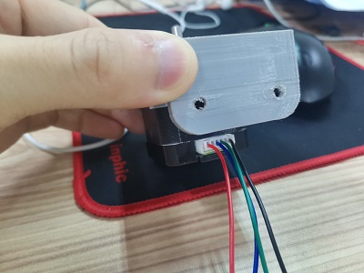

# 步进电机
## 接线引脚
单片机正放接线颜色:  
  
==鉴于单片机的驱动能力，一般对信号口采用共阳接法（即）PUL+，DIR+，ENA+接到一起然后再接到控制器的高电平或VCC==  
==对于使能ENA，它是以EAN+与ENA-电平相同为使能==  

驱动相位接线表  
（此表采用共阳式接法，DIR-接高）
接线顺序\转向|顺时针|逆时针|顺时针|逆时针
:-:|:-:|:-:|:-:|:-:
A+|蓝|黑|黑|蓝
A-|黑|蓝|蓝|黑
B+|红|红|绿|绿
B-|绿|绿|红|红
==不管怎么接，A+与A-一定要相配，即A+与A-用电笔蜂鸣档一定要有响（B+和B-同理）==